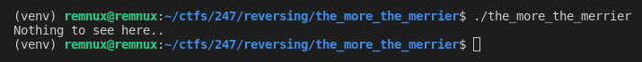
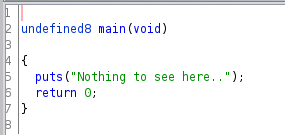
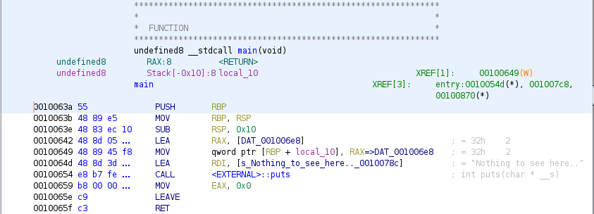
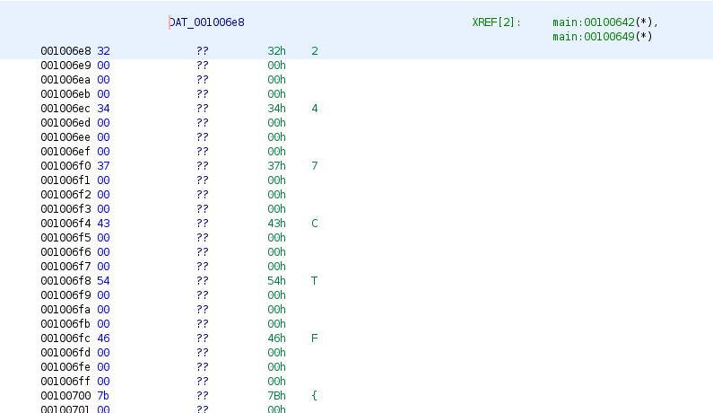

# Prompt

> One byte is great. But what if you need more? Can you find the flag hidden in this binary?

# Solution

## Initial Assessment

### Execution

Running the binary just prints an unhelpful message to the screen:



### Strings

Looking at the strings for the binary doesn't give us anything helpful either:

```
/lib64/ld-linux-x86-64.so.2
libc.so.6
puts
__cxa_finalize
__libc_start_main
GLIBC_2.2.5
_ITM_deregisterTMCloneTable
__gmon_start__
_ITM_registerTMCloneTable
AWAVI
AUATL
[]A\A]A^A_
Nothing to see here..
;*3$"
.shstrtab
.interp
.note.ABI-tag
.note.gnu.build-id
.gnu.hash
.dynsym
.dynstr
.gnu.version
.gnu.version_r
.rela.dyn
.rela.plt
.init
.plt.got
.text
.fini
.rodata
.eh_frame_hdr
.eh_frame
.init_array
.fini_array
.dynamic
.data
.bss
```

## Ghidra

At this point I take the binary and toss it into ghidra to see what we're working with.

The decompilation of the main function doesn't show us anything interesting either:



The dissassembly is quite a bit more interesting though. 
Looking at it, we see that some value at \[DAT_001006e8\] is being referenced but not used.



Looking at the bytes of that address reveals the flag with each character surrounded by null bytes.
This null byte padding around the characters is what prevented the `strings` command from recognizing the flag as a string (and ghidra as well).



Using the pwntools library and a bit of python, we can extract these flag bytes as seen in [my script](./get_flag.py).

## Alternative

Since we now know that the flag exists within the binary as a string (with some null padding issues) we can use a bit of shell magic to extract it.

```sh
strings -n 1 the_more_the_merrier | awk '{print}' ORS='' | grep -o 247CTF{.*}
```

### Command Breakdown

- `strings -n 1 the_more_the_merrier`
    - Display all printable characters contained within the binary
    - Strings will only print strings of length 4 or greater by default (thus the -n 1 flag)
- `awk '{print}' ORS=''`
    - Replace all newlines from the strings command with empty string (so we can grep)
- `grep -o 247CTF{.*}`
    - Extract the flag 😎